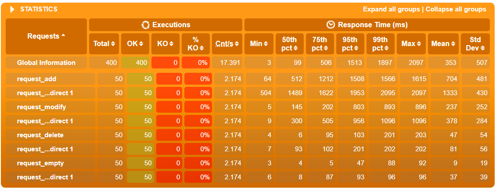

# Task One
## 1. 创建镜像
根据课程视频进行操作，使用google.cloud.tools工具，创建第一个镜像并命名为jdpos,
```xml
<plugin>
    <groupId>com.google.cloud.tools</groupId>
    <artifactId>jib-maven-plugin</artifactId>
    <version>3.2.0</version>
    <configuration>
    <to>
    	<image>jdpos</image>
    </to>
    </configuration>
</plugin>
```
## 2. 垂直扩展压力测试
分别为镜像分配0.5与1个CPU
```
docker run -d --name jdpos-0.5 --cpus=0.5 -p 18888:8888 jdpos
docker run -d --name jdpos-1 --cpus=1 -p 18889:8888 jdpos
```
然后分别对这两个镜像进行压力测试，测试五个用户添加物品，增加物品，删除物品，清空购物车功能
```java
scenario("TaskOne Cpu=0.5")
    .exec(http("request_add").get("/add?pid=10058164"))
    .pause(6)
    .exec(http("request_add").get("/modify?pid=10058164&amount=1"))
    .pause(6)
    .exec(http("request_add").get("/delete?pid=10058164"))
    .pause(6)
    .exec(http("request_add").get("/empty"));
setUp(scn.injectOpen(atOnceUsers(5)).protocols(httpProtocol));
```
0.5个CPU结果：

1个CPU结果

结论：CPU数目增加时，会提升访问速度，但是由于本程序对计算执行较少，所以不会有显著提升。对于计算量大的程序，使用垂直扩展可以显著提升速度，但是这种方法基于CPU的性能来进行提升，成本高，上限低。